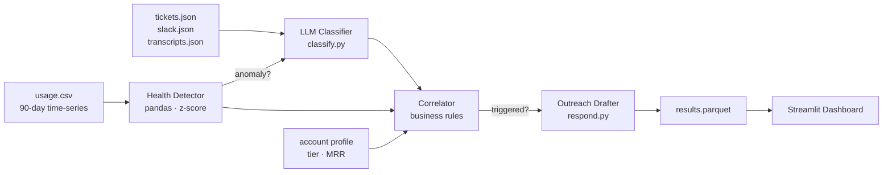

# Zero Dark Churn — Silent Churn Detection System


Detects developer API customers who are quietly disengaging before they cancel — by correlating usage health metrics, LLM-scored communications, and account value tier into a prioritised outreach list.

Built as a portfolio project for DevAPICo (fictional speech-to-text API company). All data is fully synthetic.

---

## Architecture



**Signal pipeline (four steps):**

| Step | Module | LLM? | Description |
|---|---|---|---|
| 1 | `pipeline/health.py` | No | Z-score + WoW + error-rate anomaly detection |
| 2 | `pipeline/classify.py` | Yes | Churn risk classification from communications |
| 3 | `pipeline/correlate.py` | No | Multi-signal correlation → trigger decision |
| 4 | `pipeline/respond.py` | Yes | Draft outreach email for triggered accounts |

**Key design decisions:**

- Steps 2 & 4 only run on anomalous accounts → LLM calls scale with risk, not fleet size
- Free-tier accounts are skipped entirely (no CS bandwidth wasted on $0 MRR)
- Weak single-signal anomalies require `churn_risk=high` from the LLM to trigger — seasonal dips don't create noise

---

## LLM-Agnostic Architecture

The entire system is provider-agnostic. Swap providers with a single env var:

```bash
LLM_PROVIDER=anthropic  # or openai
LLM_MODEL=claude-sonnet-4-5  # optional override
```

**Abstraction layer** (`llm/base.py`):

```
LLMClient (abstract)
    ├── OpenAIClient   (gpt-4o-mini by default)
    └── AnthropicClient (claude-sonnet-4-5 by default)
```

All responses are **transparently disk-cached** via SHA-256 of the full prompt parameters. Subsequent pipeline runs and the dashboard's "Analyse & Draft" button are near-instant for previously-seen communications.

---

## Run Locally

```bash
# 1. Install dependencies
pip install -r requirements.txt

# 2. Set your LLM API key
cp .env.example .env
# Edit .env: set LLM_PROVIDER=openai and OPENAI_API_KEY=...

# 3. (Optional) Regenerate the synthetic dataset
python -m data.generate

# 4. (Optional) Re-run the detection pipeline
python -m pipeline.run

# 5. Launch the dashboard
streamlit run dashboard/app.py
```

> `data/output/` is committed — step 5 works out of the box without running 3 or 4.

---

## Deploy to Streamlit Community Cloud

1. Fork this repo
2. Go to [share.streamlit.io](https://share.streamlit.io) → New app → point to `dashboard/app.py`
3. In **Secrets**, add:
   ```toml
   LLM_PROVIDER = "openai"
   OPENAI_API_KEY = "sk-..."
   ```
4. Deploy — the dashboard loads immediately from the committed `results.parquet`

The "Analyse & Draft" button will call the LLM only when an account's communications differ from the stored checksum.

---

## Evaluation Results

Against 100 synthetic accounts (15 planted churn, 5 FP traps, 80 healthy):

| Metric | Value |
|---|---|
| Precision | 100% |
| Recall | 93% |
| F1 | 0.96 |
| FP traps blocked | 5/5 |

**One miss** (`acc_0009`): WoW decline was −21.8%, just below the 30% detection threshold.  
**Zero false positives**: seasonal dip and transient error traps were correctly held by the correlator's weak-anomaly rule.

See `evaluation/evaluate.ipynb` for the full confusion matrix, per-signal-mix breakdown, and confidence threshold sweep.

---

## Project Structure

```
silent-churn/
├── data/
│   ├── generate.py          # Synthetic dataset generator (LLM-assisted)
│   └── output/              # Committed: CSVs, JSONs, results.parquet
├── llm/
│   ├── base.py              # Abstract LLMClient + disk cache
│   ├── openai_client.py
│   ├── anthropic_client.py
│   └── factory.py           # get_client() reads LLM_PROVIDER env var
├── pipeline/
│   ├── health.py            # Anomaly detection (pure pandas)
│   ├── classify.py          # LLM churn risk classification
│   ├── correlate.py         # Business-rule correlation engine
│   ├── respond.py           # Draft outreach email generator
│   ├── run.py               # Orchestrator + CLI
│   └── utils.py             # compute_comms_checksum()
├── dashboard/
│   └── app.py               # Streamlit dashboard (3 tabs)
├── evaluation/
│   └── evaluate.ipynb       # Precision/recall/F1 + threshold tuning
├── tests/
│   ├── test_llm.py          # LLM abstraction + cache tests
│   └── test_pipeline.py     # Health, correlator, checksum tests
└── .streamlit/
    └── config.toml          # Dark theme for Streamlit Cloud
```

---

## Tests

```bash
pytest tests/ -v
# 32 tests (2 skipped — live API, require real keys)
```

---

*Portfolio project · synthetic data · no real customer information*
